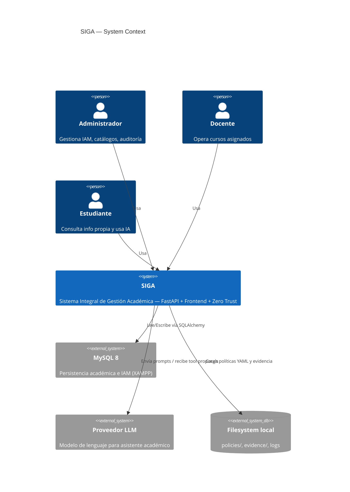
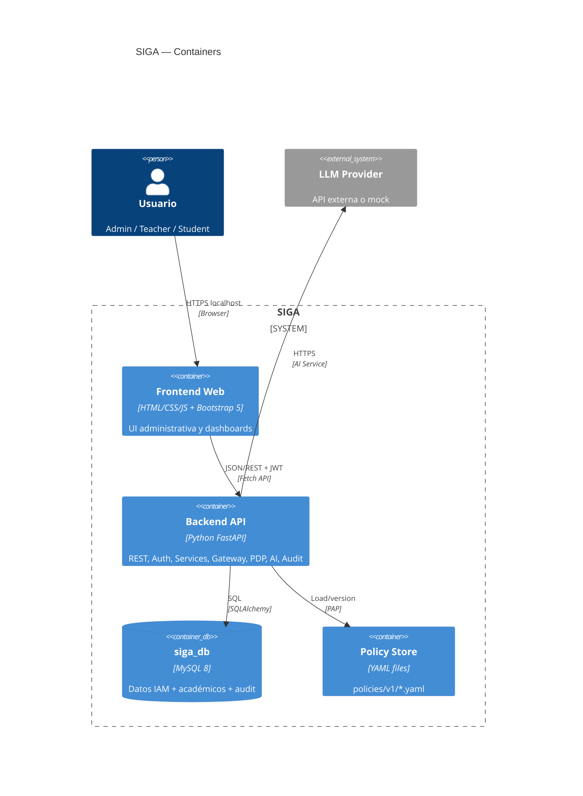
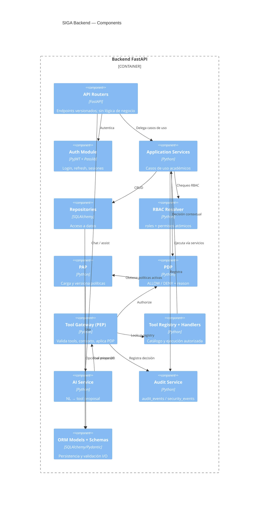

# A01 — C4 Architecture (Context · Container · Component)

| Campo | Valor |
|---|---|
| Proyecto | SIGA (`siga-polkdev`) |
| Fase | F3 — Arquitectura |
| Skill | K-002 Architecture Designer |
| Spec | S03, S05, S09 |
| Fecha | 2026-09-20 |

---

## 1. C4 Level 1 — System Context



### Responsabilidades del sistema

| Sistema | Responsabilidad |
|---|---|
| SIGA | Autenticación, autorización, dominio académico, IA mediada, auditoría |
| MySQL | Persistencia transaccional |
| LLM | Interpretar NL y proponer tools (sin ejecución privilegiada) |
| Filesystem | Políticas versionadas y evidencia de laboratorio |

---

## 2. C4 Level 2 — Containers



### Contratos entre contenedores

| Desde | Hacia | Protocolo | Auth |
|---|---|---|---|
| Frontend | Backend API | HTTP JSON REST | Bearer JWT |
| Backend | MySQL | TCP 3306 | Credenciales `.env` |
| Backend | LLM | HTTPS | API key en `.env` |
| Backend | Policy Store | Filesystem read | Solo proceso backend |

---

## 3. C4 Level 3 — Components (Backend)



### Mapa componente → paquete objetivo (`app/backend/app/`)

| Componente | Paquete |
|---|---|
| API Routers | `api/` |
| Auth | `auth/` |
| Services | `services/` |
| Repositories | `repositories/` |
| RBAC | `permissions/` |
| PAP/PDP | `policy/` |
| Tool Gateway | `gateway/` |
| Tools | `tools/` |
| AI | `ai/` |
| Audit | `audit/` |
| Models/Schemas | `models/`, `schemas/` |
| Config | `core/`, `config/`, `db/` |

---

## 4. Frontend — componentes lógicos

```text
frontend/
├── pages/          # login, dashboards, módulos por rol
├── components/     # tablas, forms, nav, alerts
├── js/             # api-client, auth-store, guards UI (no autoridad real)
├── css/
└── assets/
```

Regla: **el frontend nunca autoriza**; solo oculta UI. La autoridad es siempre backend/PDP.

---

## 5. Definición de bloques F3 (checklist PromptMaster)

| Bloque | Documento / sección |
|---|---|
| Backend | A01 §3 + A04 deployment |
| Frontend | A01 §4 |
| Database | A02 ERD |
| AI | A01 + A03 SEQ-AI |
| Gateway | A01 Component `gw` + A03 SEQ-AI |
| PAP | A01 Component `pap` + A05 |
| PDP | A01 Component `pdp` + A05 |
| Audit | A01 Component `audit` + A03 |

---

## 6. Trazabilidad

| Artefacto | Relación |
|---|---|
| S03 | Vista preliminar refinada aquí |
| S09 ADR-004/005/006/007 | Decisiones aplicadas |
| A02 | Persistencia |
| A03 | Comportamiento dinámico |
| A04 | Despliegue local |
| A05 | Contratos PAP/PDP/Gateway |
