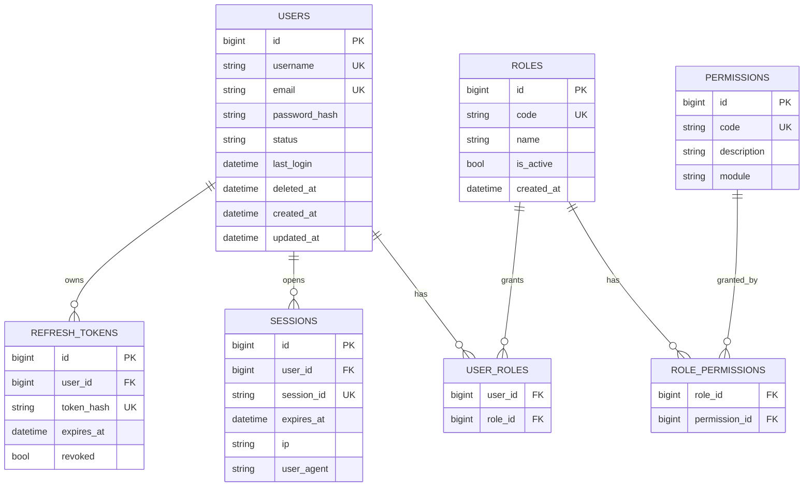
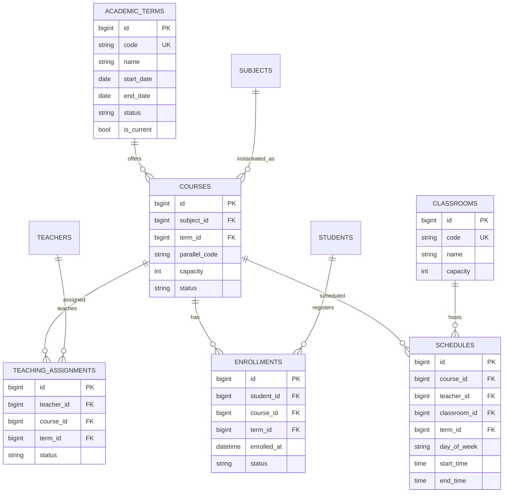
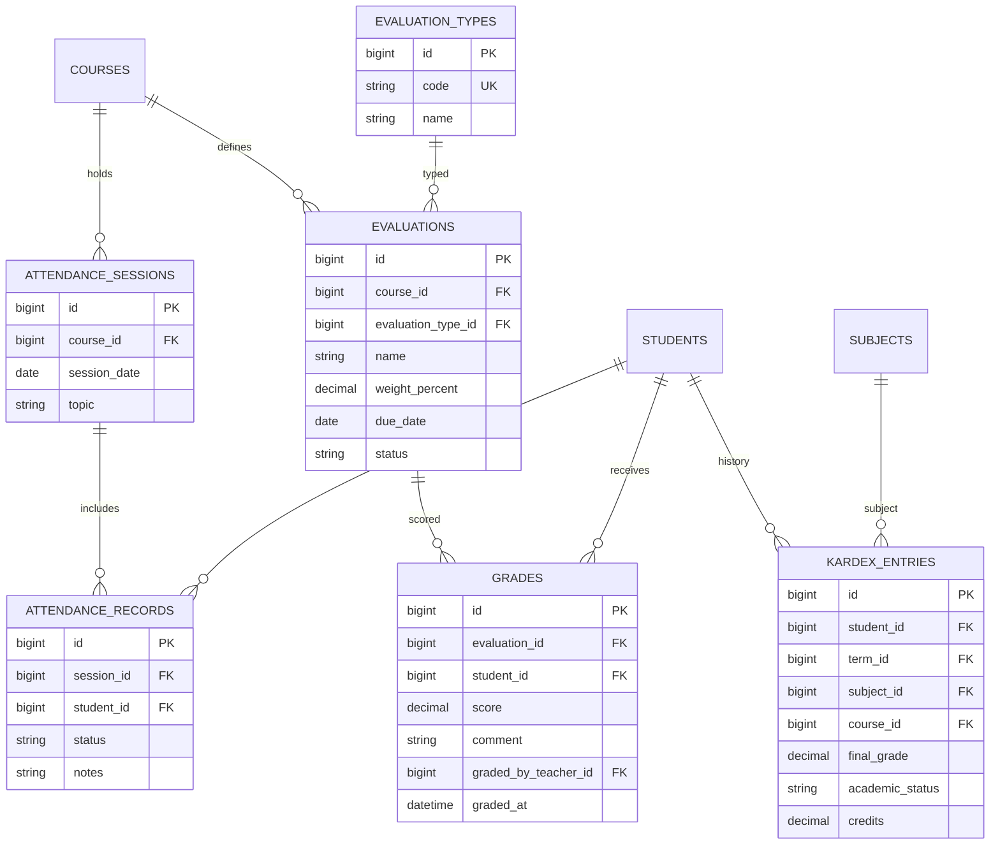
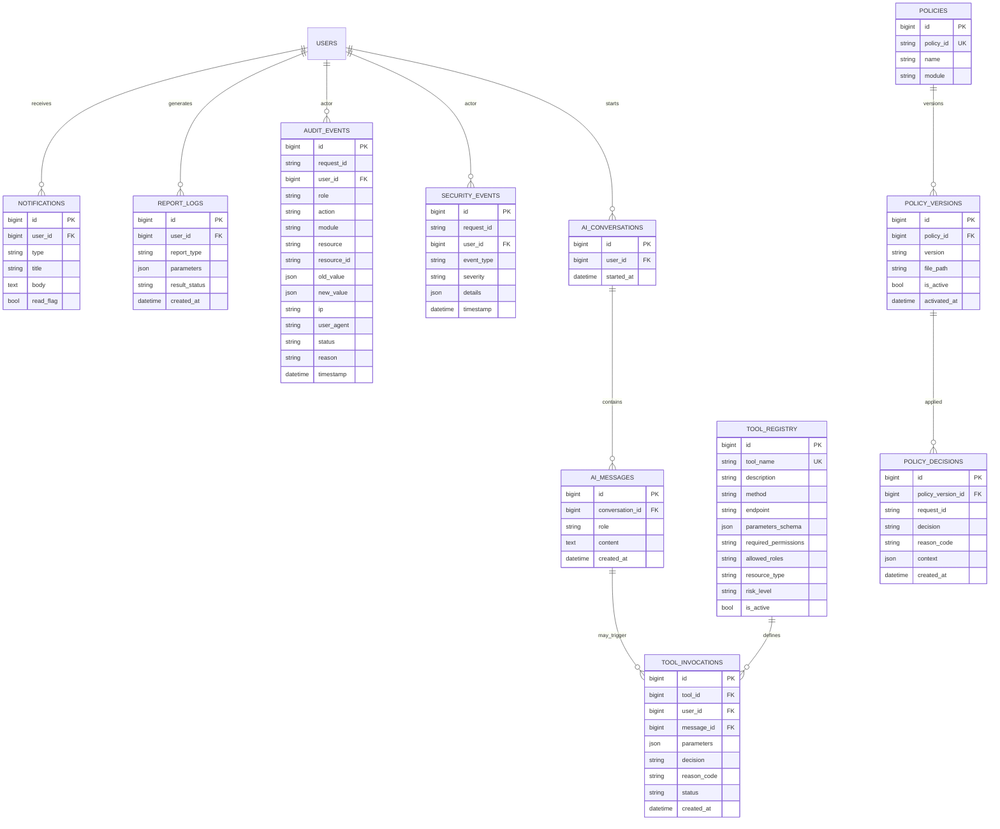

# A02 — ERD (Entity Relationship Diagram)

| Campo | Valor |
|---|---|
| Proyecto | SIGA (`siga-polkdev`) |
| Fase | F3 — Arquitectura |
| Skill | K-002 Architecture Designer |
| Spec | S03 §7, PromptMaster §45–46 |
| Fecha | 2026-09-20 |

---

## 1. Convenciones

| Convención | Valor |
|---|---|
| PK | `id` BIGINT AUTO_INCREMENT salvo tablas puente |
| Timestamps | `created_at`, `updated_at` |
| Soft delete | `deleted_at` NULL en entidades académicas/IAM críticas |
| Status | ENUM / VARCHAR controlado por Spec |
| Nombres | snake_case plural |

---

## 2. ERD — IAM y sesiones



---

## 3. ERD — Personas académicas y catálogo

```mermaid
erDiagram
  USERS ||--o| STUDENTS : profile
  USERS ||--o| TEACHERS : profile
  CAREERS ||--o{ STUDENTS : enrolled_in
  CAREERS ||--o{ CURRICULUM : has
  CURRICULUM ||--o{ CURRICULUM_SUBJECTS : contains
  SUBJECTS ||--o{ CURRICULUM_SUBJECTS : listed
  SUBJECTS ||--o{ SUBJECT_PREREQUISITES : requires
  SUBJECTS ||--o{ SUBJECT_PREREQUISITES : required_by

  STUDENTS {
    bigint id PK
    bigint user_id FK_UK
    string student_code UK
    bigint career_id FK
    string level
    date admission_date
    string status
    datetime deleted_at
  }

  TEACHERS {
    bigint id PK
    bigint user_id FK_UK
    string teacher_code UK
    string specialty
    string status
    datetime deleted_at
  }

  CAREERS {
    bigint id PK
    string code UK
    string name
    string modality
    int duration_semesters
    string status
  }

  CURRICULUM {
    bigint id PK
    bigint career_id FK
    string version
    string status
  }

  CURRICULUM_SUBJECTS {
    bigint id PK
    bigint curriculum_id FK
    bigint subject_id FK
    int level
    int semester
    decimal credits
  }

  SUBJECTS {
    bigint id PK
    string code UK
    string name
    text description
    decimal credits
    int hours
    string type
    string status
  }

  SUBJECT_PREREQUISITES {
    bigint subject_id FK
    bigint prerequisite_subject_id FK
  }
```

---

## 4. ERD — Operación académica



**ABAC clave:** `TEACHING_ASSIGNMENTS(teacher_id, course_id, term_id)` debe existir para writes de asistencia/notas.

---

## 5. ERD — Asistencia, evaluaciones, notas, kardex



**Regla evaluaciones:** `SUM(weight_percent) WHERE course_id = X AND status active <= 100`.

**Estados kardex:** APPROVED | FAILED | IN_PROGRESS | WITHDRAWN.

---

## 6. ERD — Plataforma, IA, políticas, auditoría



---

## 7. Integridad y restricciones

| Regla | Aplicación |
|---|---|
| FK ON DELETE RESTRICT | Datos académicos críticos |
| UNIQUE (course_id, parallel) por term | Evitar duplicados |
| UNIQUE (student_id, course_id, term_id) enrollment ACTIVE | Una matrícula activa |
| UNIQUE (teacher_id, course_id, term_id) assignment | Asignación única |
| CHECK weight_percent > 0 | Evaluaciones |
| Indexes | user_id, course_id, term_id, request_id, tool_name |

---

## 8. Notas de implementación (F5/F6)

- Migraciones Alembic por oleada (O1 IAM → O2 catálogo → …).
- Seed: roles, permisos base, policies v1, tools iniciales.
- Soft delete: repositorios filtran `deleted_at IS NULL` por defecto.
