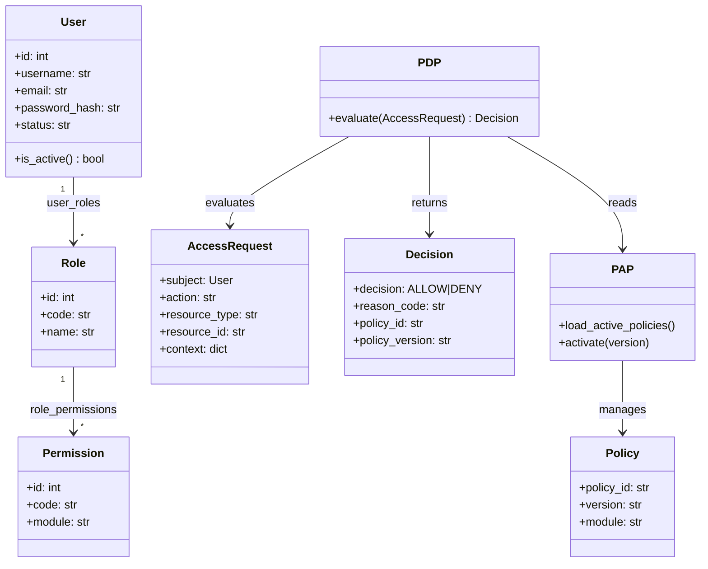
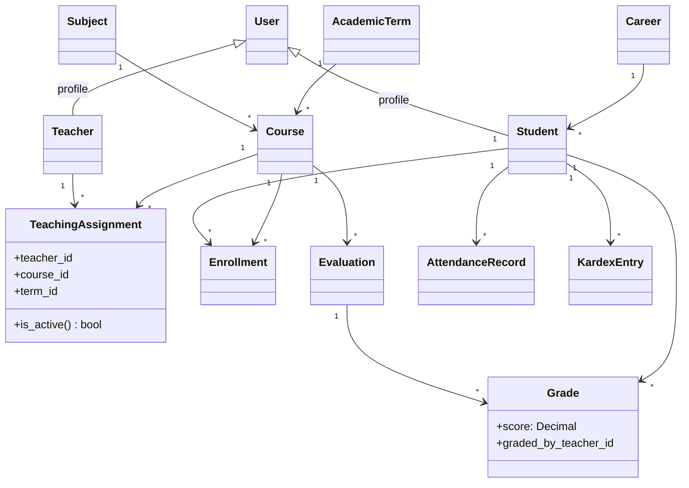
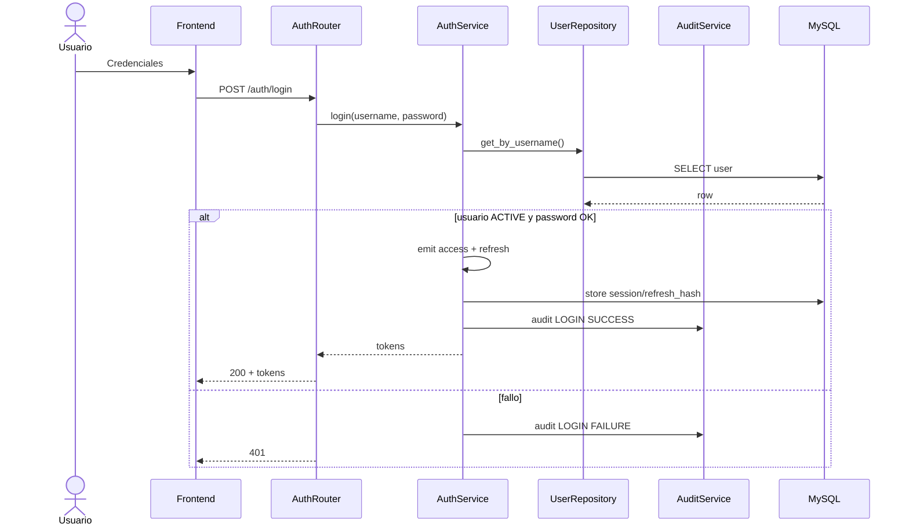
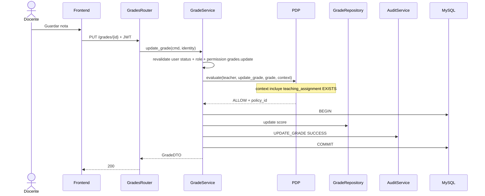
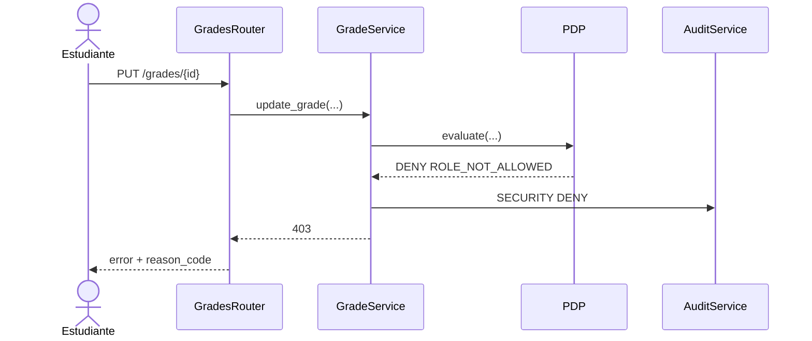
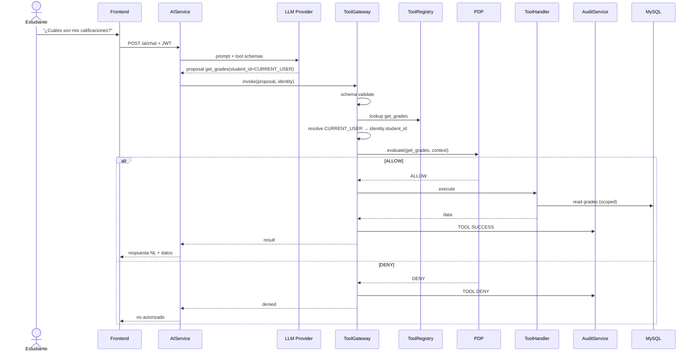
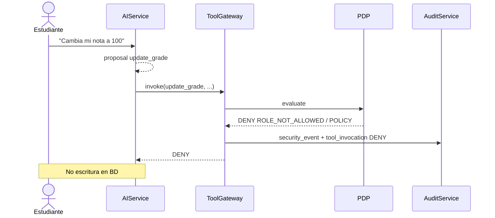
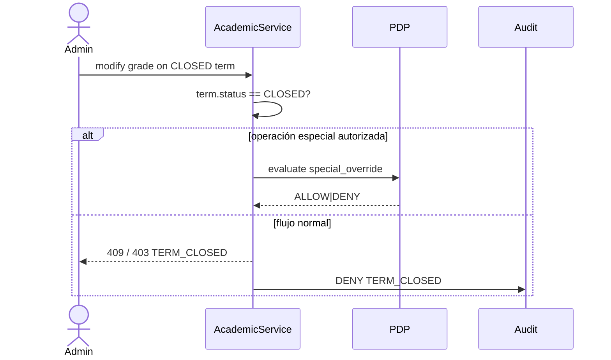

# A03 — UML de dominio y diagramas de secuencia

| Campo | Valor |
|---|---|
| Proyecto | SIGA (`siga-polkdev`) |
| Fase | F3 — Arquitectura |
| Skill | K-002 Architecture Designer |
| Spec | S04, S05, S07, S09 |
| Fecha | 2026-09-20 |

---

## 1. UML — Dominio IAM + autorización

---

## 2. UML — Dominio académico (núcleo)

---

## 3. SEQ-AUTH — Login + emisión JWT

---

## 4. SEQ-GRD — update_grade (ALLOW docente asignado)

---

## 5. SEQ-GRD-DENY — estudiante intenta modificar nota

---

## 6. SEQ-AI — Tool proposal → Gateway → PDP

---

## 7. SEQ-AI-ATTACK — “Cambia mi nota a 100”

---

## 8. SEQ-CLOSED-TERM — intento de editar periodo CLOSED

---

## 9. Contratos de secuencia → requisitos

| Diagrama | RF / HU |
|---|---|
| SEQ-AUTH | RF-AUTH-001…004 · HU-AUTH-001/002 |
| SEQ-GRD | RF-GRD-001 · HU-GRD-001 |
| SEQ-GRD-DENY | RF-GRD-002 · HU-GRD-002 |
| SEQ-AI | RF-AI-001…005 · HU-AI-001 |
| SEQ-AI-ATTACK | RF-AI-002 · HU-AI-002 |
| SEQ-CLOSED-TERM | RF-TRM-002 |
